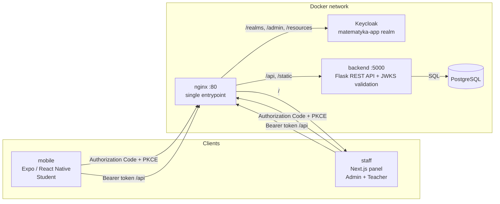

# Infiro

An educational mathematics platform — structured course content, adaptive leveling tests, and role-based panels for students, teachers, and admins. Built on Keycloak for OAuth2 / OpenID Connect authentication, with a Flask REST API, a Next.js panel, and an Expo mobile app, all running behind a single nginx entrypoint via `docker compose`.

<p>
  
  
  
  
  
  
</p>

## Overview

The project organizes course content into sections → subsections → tasks, each task carrying per-theme variants so the same exercise can be presented with different interest-based framing. Students work through this content and a randomized leveling test from a React Native (Expo) app; admins manage content, students, and teachers, while teachers get read-only access to student results, both from a Next.js panel. A single Flask REST API backs both clients and validates every request by verifying the JWT against Keycloak's JWKS endpoint. Keycloak is the single source of truth for identity — the realm defines the `admin` role and the `nauczyciele` (teachers) group, everyone else is treated as a student.

## Table of Contents

- [Infiro](#infiro)
  - [Overview](#overview)
  - [Table of Contents](#table-of-contents)
  - [Features](#features)
  - [Architecture](#architecture)
  - [Tech Stack](#tech-stack)
  - [Getting Started](#getting-started)
    - [Prerequisites](#prerequisites)
    - [Clone](#clone)
    - [Environment Variables](#environment-variables)
    - [Run Backend \& Infrastructure](#run-backend--infrastructure)
    - [Run the Mobile App](#run-the-mobile-app)
  - [Services](#services)
  - [User Roles](#user-roles)
  - [Creating Accounts](#creating-accounts)
  - [API Reference](#api-reference)
  - [Project Structure](#project-structure)
  - [Documentation](#documentation)

## Features

**Course content**
- Content structured as sections → subsections → tasks
- Tasks support per-theme (interest-based) variants of the same exercise
- Admin panel — create, edit, and delete sections, subsections, and tasks
- Bulk task import from a JSON file, including image uploads
- Knowledge materials attached to sections and subsections

**Students**
- Browse sections and subsections, work through tasks
- Randomized leveling (diagnostic) test with attempt history
- Personal stats, interests, and profile

**Teachers & Admins**
- Teacher panel — view student results
- Admin panel — manage students and teachers, review student details
- Role and access control fully driven by Keycloak (realm roles + groups)

**Authentication**
- Login and registration via Keycloak (OAuth2 + OpenID Connect)
- Backend validates every request by fetching signing keys from Keycloak's JWKS endpoint — no session state on the API
- A single nginx entrypoint routes traffic to Keycloak, the API, and the web panel

## Architecture



## Tech Stack

| Layer | Technology |
|---|---|
| Authorization Server | Keycloak 26 |
| Backend | Python 3.12, Flask, Flask-SQLAlchemy, Flask-Migrate, PyJWT |
| Web panel (staff) | Next.js 15 (App Router), keycloak-js |
| Mobile app | Expo, React Native, Expo Router, expo-auth-session, NativeWind |
| Database | PostgreSQL 16 |
| Reverse proxy | nginx |
| Infrastructure | Docker Compose |

## Getting Started

### Prerequisites

| Tool | Version |
|---|---|
| Docker Desktop | latest |
| Docker Compose | v2+ |
| Node.js | 20+ (for running the mobile app locally) |
| Android Studio or Expo Go | for running the mobile app |

### Clone

```bash
git clone https://github.com/jpolchowska/infiro.git
cd infiro
```

### Environment Variables

```bash
cp .env.example .env
# fill in .env with your values
```

Create the database password secret:

```bash
echo "mysecretpassword" > infrastructure/secrets/db_password.txt
```

Then set up the mobile app's environment file — see [Run the Mobile App](#run-the-mobile-app).

### Run Backend & Infrastructure

First run, or after changing a Dockerfile:

```bash
docker compose build
```

Every time while developing (rebuilds and syncs on file changes):

```bash
docker compose watch
```

### Run the Mobile App

```bash
cp mobile/.env.example mobile/.env
# fill in mobile/.env — see the comments in mobile/.env.example for
# Android Studio vs. Expo Go configuration
```

From the `mobile/` directory:

```bash
npx expo start
```

- **Android Studio:** press `a` once the dev server starts.
- **Expo Go:** scan the printed QR code.

## Services

Everything is served through the nginx entrypoint on `http://localhost`:

| Path | Routed to |
|---|---|
| `/` | staff — Next.js panel |
| `/api/`, `/static/` | backend — Flask REST API |
| `/realms/`, `/admin/`, `/resources/` | Keycloak |

## User Roles

| Role | Permissions |
|---|---|
| **Admin** | manage sections, subsections, tasks, materials, students, and teachers |
| **Teacher** (`nauczyciele` group) | view student results |
| **Student** (default) | browse content, complete tasks, take the leveling test |

## Creating Accounts

Account creation and role assignment currently happen directly in the Keycloak admin console, under the `matematyka-app` realm.

**Student (Uczeń)**
1. Log in to the Keycloak admin console.
2. Go to the `matematyka-app` realm → **Users** → create a new user with the form.

**Teacher (Nauczyciel)**
1. Same as above, then open the created user → **Groups** → **Join Group**.
2. Select `nauczyciele` and join.

**Admin (Administrator)**
1. Create the user as above.
2. Create an `admin` role under **Realm roles** (if it doesn't exist yet).
3. On the user, go to **Role mapping** → **Assign role**, filter by realm roles, and assign `admin`.

## API Reference

All endpoints require `Authorization: Bearer <token>` unless noted otherwise.

| Method | Endpoint | Description |
|---|---|---|
| `GET` | `/api/public` | Health/status check (public) |
| `GET` | `/api/tasks` | List tasks |
| `GET` | `/api/tasks/:id` | Get a single task |
| `GET` | `/api/student` | Student overview |
| `GET` | `/api/student/me` | Current student's profile |
| `PATCH` | `/api/student/interest` | Update student interests |
| `GET` | `/api/student/sections` | List sections for the student |
| `GET` | `/api/student/subsections/:id/tasks` | List tasks in a subsection |
| `GET` | `/api/student/stats` | Student statistics |
| `GET` | `/api/student/leveling-test` | Get a leveling test attempt |
| `POST` | `/api/student/leveling-test/submit` | Submit a leveling test attempt |
| `GET` | `/api/student/leveling-test/history` | List past leveling test attempts |
| `GET` | `/api/admin/sections` | List sections |
| `POST` | `/api/admin/sections` | Create a section |
| `GET`/`PATCH`/`DELETE` | `/api/admin/sections/:id` | Get, update, or delete a section |
| `POST` | `/api/admin/sections/:id/subsections` | Create a subsection |
| `GET`/`PATCH`/`DELETE` | `/api/admin/subsections/:id` | Get, update, or delete a subsection |
| `POST` | `/api/admin/subsections/:id/tasks` | Create a task |
| `PATCH`/`DELETE` | `/api/admin/tasks/:id` | Update or delete a task |
| `POST` | `/api/admin/tasks/import` | Bulk-import tasks from JSON |
| `POST` | `/api/admin/uploads/images` | Upload a task image |
| `POST` | `/api/admin/sections/:id/materials` | Add a material to a section |
| `POST` | `/api/admin/subsections/:id/materials` | Add a material to a subsection |
| `PATCH`/`DELETE` | `/api/admin/materials/:id` | Update or delete a material |
| `GET` | `/api/admin/teachers` | List teachers |
| `GET` | `/api/admin/students` | List students |
| `GET`/`PATCH` | `/api/admin/students/:id` | Get or update a student |

## Project Structure

```
infiro/
├── backend/
│   ├── app/
│   │   ├── models/            # SQLAlchemy models
│   │   ├── middleware/auth.py # JWT/JWKS verification
│   │   ├── routes/            # public, student, tasks, leveling test, admin routes
│   │   └── services/
│   ├── migrations/            # Flask-Migrate migrations
│   ├── seed/                  # seed data
│   └── tests/
├── staff/                     # Next.js panel (admin + teacher)
├── mobile/                    # Expo app (student + teacher), Expo Router
├── infrastructure/
│   ├── realm-export.json      # Keycloak realm — auto-imported on startup
│   ├── nginx.conf             # single entrypoint / reverse proxy config
│   └── secrets/db_password.txt
├── docs/                      # task JSON format spec, etc.
├── compose.yaml
└── .env.example
```

## Documentation

- [docs/format-zadan.md](docs/format-zadan.md) — JSON format spec for the task import file used by the admin panel's import feature.
