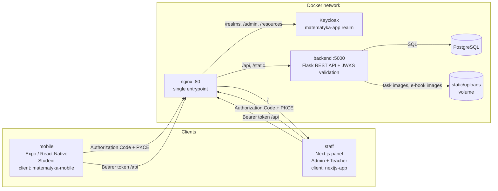

# Infiro

An educational mathematics platform — structured course content, adaptive leveling tests, and role-based panels for students, teachers, and admins. Built on Keycloak for OAuth2 / OpenID Connect authentication, with a Flask REST API, a Next.js panel, and an Expo mobile app, all running behind a single nginx entrypoint via `docker compose`.

<p>
  
  
  
  
  
  
</p>

## Overview

The project organizes course content into sections → subsections → tasks, with a short theory e-book attached to each subsection. Tasks come in three types and three difficulty levels, and every task carries per-theme variants so the same exercise can be framed around a student's interests. Students work through this content, a leveling test, and timed practice from a React Native (Expo) app; admins manage content, students, and teachers, while teachers get read-only access to sections and the results of their assigned students, both from a Next.js panel. A single Flask REST API backs both clients and validates every request by verifying the JWT against Keycloak's JWKS endpoint. Keycloak is the single source of truth for identity — the realm defines the `admin`, `ROLE_TEACHER`, and `ROLE_STUDENT` roles, and members of the `nauczyciele` (teachers) group receive `ROLE_TEACHER`.

## Table of Contents

- [Infiro](#infiro)
  - [Overview](#overview)
  - [Table of Contents](#table-of-contents)
  - [Features](#features)
  - [Architecture](#architecture)
  - [Tech Stack](#tech-stack)
  - [Getting Started](#getting-started)
    - [Prerequisites](#prerequisites)
    - [Clone](#clone)
    - [Environment Variables](#environment-variables)
    - [Run Backend \& Infrastructure](#run-backend--infrastructure)
    - [Run the Mobile App](#run-the-mobile-app)
    - [Run Tests](#run-tests)
  - [Services](#services)
  - [User Roles](#user-roles)
  - [Creating Accounts](#creating-accounts)
  - [Content Import](#content-import)
  - [API Reference](#api-reference)
  - [Project Structure](#project-structure)
  - [Documentation](#documentation)

## Features

**Course content**
- Content structured as sections → subsections → tasks
- Three task types — single choice, short answer, and memory (pair matching)
- Three difficulty levels per subsection
- Per-theme variants of every task, chosen from seven student interests (sport, games, LEGO, animals, drawing, music, food)
- One theory e-book per subsection, with text, images, lists, and callouts
- Bulk import of tasks (JSON) and e-books (ZIP with images) from the admin panel

**Students**
- Browse sections and subsections, work through tasks with instant feedback
- Three attempts per task; the solution is revealed after the last failed attempt
- Higher difficulty levels unlock once every task on the level below is solved
- Timed practice — up to 20 single-choice questions in 60 seconds
- Leveling (diagnostic) test with per-section results and attempt history
- Theory e-book reader
- Fractions rendered in stacked notation
- Personal stats, interests, and profile

**Teachers & Admins**
- Teacher panel — read-only view of sections and the results of assigned students
- Admin panel — manage sections, subsections, tasks, students, and teachers, and import content
- Role and access control fully driven by Keycloak (realm roles + groups)

**Authentication**
- Login and registration via Keycloak (OAuth2 + OpenID Connect)
- Backend validates every request by fetching signing keys from Keycloak's JWKS endpoint — no session state on the API
- A single nginx entrypoint routes traffic to Keycloak, the API, and the web panel

## Architecture



## Tech Stack

| Layer | Technology |
|---|---|
| Authorization Server | Keycloak 26 |
| Backend | Python 3.12, Flask, Flask-SQLAlchemy, Flask-Migrate (applied on startup), PyJWT, jsonschema, Pillow |
| Web panel (staff) | Next.js 15 (App Router), React 19, TypeScript, Tailwind CSS 4, keycloak-js |
| Mobile app | Expo SDK 57, React Native 0.86, React 19, TypeScript, Expo Router, expo-auth-session, NativeWind |
| Database | PostgreSQL 16 |
| File storage | Docker bind mount (`backend/app/static/uploads`) for task and e-book images |
| Reverse proxy | nginx |
| Testing | pytest |
| Infrastructure | Docker Compose |

## Getting Started

### Prerequisites

| Tool | Version |
|---|---|
| Docker Desktop | latest |
| Docker Compose | v2+ |
| Node.js | 20+ (for running the mobile app locally) |
| Android Studio or Expo Go | for running the mobile app |

### Clone

```bash
git clone https://github.com/jpolchowska/infiro.git
cd infiro
```

### Environment Variables

```bash
cp .env.example .env
# fill in .env with your values
```

Create the database password secret:

```bash
echo "mysecretpassword" > infrastructure/secrets/db_password.txt
```

Then set up the mobile app's environment file — see [Run the Mobile App](#run-the-mobile-app).

### Run Backend & Infrastructure

First run, or after changing a Dockerfile:

```bash
docker compose build
```

Every time while developing (rebuilds and syncs on file changes):

```bash
docker compose watch
```

Database migrations are applied automatically when the backend starts. A fresh database contains no content, so once the stack is up, [create an admin account](#creating-accounts) and [import content](#content-import) before opening the mobile app.

### Run the Mobile App

```bash
cp mobile/.env.example mobile/.env
# fill in mobile/.env — see the comments in mobile/.env.example for
# Android Studio vs. Expo Go configuration
```

From the `mobile/` directory:

```bash
npx expo start
```

- **Android Studio:** press `a` once the dev server starts.
- **Expo Go:** scan the printed QR code.

### Run Tests

Backend tests run with pytest inside the running `backend` container:

```bash
docker compose exec backend python -m pytest tests -q
```

### Run production (test version)

**Prerequisites (one-time setup):**
- Install `mkcert` and run `mkcert -install`
- Generate a certificate:
```bash
  cd infrastructure/certs && mkcert mathiro.test "*.mathiro.test"
```
- Add `mathiro.test` to your hosts file:
```bash
  echo "127.0.0.1 mathiro.test" | sudo tee -a /etc/hosts
```
- Install `cloudflared`

**Steps:**

1. When starting production for the first time, you have to run `docker compose down -v`. This removes all data. It's needed because `infrastructure/postgres-init/` contains a script that creates a separate database for Keycloak, and that script only runs when the Postgres volume is freshly initialized. It is also possible to create the database manually, without wiping existing data:
```bash
   docker compose exec postgres psql -U $DB_USER -d postgres \
     -c "CREATE USER keycloak WITH PASSWORD 'your_password';" \
     -c "CREATE DATABASE keycloak OWNER keycloak;"
```

2. Create the tunnel (leave this terminal open for the whole testing session):
```bash
   cloudflared tunnel --url https://localhost:443 --no-tls-verify
```
   Copy the generated `https://xxxx.trycloudflare.com` address — it changes every time the tunnel is restarted.

3. Go to all `.env.prod.example` files and, using the info inside them, fill in the actual `.env` files.

4. Build and start the stack:
```bash
   docker compose -f compose.yaml -f compose.prod.yaml up --build -d
```
   Check that everything came up healthy:
```bash
   docker compose -f compose.yaml -f compose.prod.yaml ps
```

5. Log into Keycloak as admin (`https://mathiro.test/admin/` or through link), switch to the `matematyka-app` realm, open the `nextjs-staff` client, and add the tunnel URL from step 2 to both **Valid Redirect URIs** and **Web Origins** — add it alongside the existing `mathiro.test` entries, don't replace them. Keep in mind that during adding link from step 2, you have to add /* in the bacl for expample https://broader-teaches-pitch-hurricane.trycloudflare.com/* .

6. Open the app:
   - Browser, this machine: `https://mathiro.test`
   - emulator / Expo / Browser: the tunnel address from step 2

## Services

Everything is served through the nginx entrypoint on `http://localhost`:

| Path | Routed to |
|---|---|
| `/` | staff — Next.js panel |
| `/api/`, `/static/` | backend — Flask REST API |
| `/realms/`, `/admin/`, `/resources/` | Keycloak |

## User Roles

| Role | Permissions |
|---|---|
| **Admin** (`admin`) | manage sections, subsections, tasks, students, and teachers; import tasks and e-books |
| **Teacher** (`ROLE_TEACHER`, via the `nauczyciele` group) | view sections and the results of their assigned students (read-only) |
| **Student** (`ROLE_STUDENT`) | browse content, complete tasks, read e-books, take timed practice and the leveling test |

## Creating Accounts

Account creation and role assignment currently happen directly in the Keycloak admin console, under the `matematyka-app` realm.

**Student (Uczeń)**
1. Log in to the Keycloak admin console.
2. Go to the `matematyka-app` realm → **Users** → create a new user with the form.

**Teacher (Nauczyciel)**
1. Same as above, then open the created user → **Groups** → **Join Group**.
2. Select `nauczyciele` and join.

**Admin (Administrator)**
1. Create the user as above.
2. On the user, go to **Role mapping** → **Assign role**, filter by realm roles, and assign `admin` (the role is imported with the realm).

## Content Import

Course content is loaded through the admin panel (`http://localhost`, **Import treści** tab), which is available to admins only. Every file is validated before anything is saved, and errors are listed in the panel.

1. **Tasks (JSON)** — a single file describing sections → subsections → tasks. Missing sections and subsections are created automatically. Format: [docs/format-zadan.md](docs/format-zadan.md).
2. **Images (ZIP, optional)** — a ZIP archive with images used by tasks; the panel returns the uploaded file URLs.
3. **E-books (ZIP)** — one archive per subsection with an `ebook.json` file and an `images/` folder. The section and subsection must already exist, so import tasks first. Format: [docs/format-ebookow.md](docs/format-ebookow.md).

## API Reference

All endpoints except `/api/public` require `Authorization: Bearer <token>`. Errors return a JSON body with an `error` (or `message`) field and an appropriate status code.

### Public

| Method | Endpoint | Description |
|---|---|---|
| `GET` | `/api/public` | Health/status check |

### Student

Available to any authenticated user; the local student record is resolved from the token's `sub` claim (created on the first `/api/student/me` call).

| Method | Endpoint | Description |
|---|---|---|
| `GET` | `/api/student` | Authenticated ping |
| `GET` | `/api/student/me` | Current student's profile (interest, leveling test status) |
| `PATCH` | `/api/student/interest` | Set the student's interest (theme) |
| `GET` | `/api/student/stats` | Solved tasks, accuracy, current subsection, recent sections |
| `GET` | `/api/student/sections` | List sections with progress |
| `GET` | `/api/student/subsections/:id/tasks` | List tasks in a subsection, with unlocked difficulty level |
| `GET` | `/api/student/tasks/:id` | Get a task rendered in the student's theme |
| `POST` | `/api/student/tasks/:id/answers` | Submit an answer; returns correctness, attempts left, solution, and newly unlocked level |
| `GET` | `/api/student/subsections/:id/ebook` | Get the subsection's theory e-book |
| `GET` | `/api/student/subsections/:id/timed` | Get timed practice questions (60 s) |
| `POST` | `/api/student/subsections/:id/timed/submit` | Submit timed practice answers |
| `GET` | `/api/student/leveling-test` | Get a leveling test |
| `POST` | `/api/student/leveling-test/submit` | Submit a leveling test; returns score with per-section breakdown |
| `GET` | `/api/student/leveling-test/history` | List past leveling test attempts |

### Staff panel (admin & teacher)

Used by the Next.js panel and served under `/api/admin/`. Access is enforced by Keycloak realm roles; teachers get read-only endpoints and only see students assigned to them.

| Method | Endpoint | Access | Description |
|---|---|---|---|
| `GET` | `/api/admin/sections` | admin, teacher | List sections |
| `POST` | `/api/admin/sections` | admin | Create a section |
| `GET` | `/api/admin/sections/:id` | admin, teacher | Get a section |
| `PATCH`/`DELETE` | `/api/admin/sections/:id` | admin | Update or delete a section |
| `POST` | `/api/admin/sections/:id/subsections` | admin | Create a subsection |
| `GET` | `/api/admin/subsections/:id` | admin, teacher | Get a subsection |
| `PATCH`/`DELETE` | `/api/admin/subsections/:id` | admin | Update or delete a subsection |
| `POST` | `/api/admin/subsections/:id/tasks` | admin | Create a task |
| `PATCH`/`DELETE` | `/api/admin/tasks/:id` | admin | Update or delete a task |
| `POST` | `/api/admin/tasks/import` | admin | Bulk-import tasks from JSON |
| `POST` | `/api/admin/uploads/images` | admin | Upload a ZIP with images |
| `POST` | `/api/admin/ebooks/import` | admin | Import an e-book from a ZIP |
| `GET` | `/api/admin/teachers` | admin | List teachers |
| `GET` | `/api/admin/students` | admin, teacher | List students |
| `GET` | `/api/admin/students/:id` | admin, teacher | Get a student's progress details |
| `PATCH` | `/api/admin/students/:id` | admin | Update a student (e.g. assign a teacher) |

### Legacy

Still served by the backend, but not used by the current mobile app or admin panel UI.

| Method | Endpoint | Access | Description |
|---|---|---|---|
| `GET` | `/api/tasks` | authenticated | List tasks |
| `GET` | `/api/tasks/:id` | authenticated | Get a single task |
| `POST` | `/api/admin/sections/:id/materials` | admin | Add a material to a section |
| `POST` | `/api/admin/subsections/:id/materials` | admin | Add a material to a subsection |
| `PATCH`/`DELETE` | `/api/admin/materials/:id` | admin | Update or delete a material |

## Project Structure

```
infiro/
├── backend/
│   ├── app/
│   │   ├── models/                # SQLAlchemy models (users, sections, tasks, ebooks, answers, ...)
│   │   ├── middleware/auth.py     # JWT/JWKS verification, realm role checks
│   │   ├── routes/
│   │   │   ├── student*.py        # profile, sections/subsections, tasks, timed practice, stats
│   │   │   ├── leveling_test.py   # leveling test, submit, history
│   │   │   ├── admin_*.py         # sections, materials, students, task/e-book import
│   │   │   ├── tasks.py           # legacy task endpoints
│   │   │   └── public.py          # status check
│   │   ├── services/              # user handling, image upload/ZIP extraction
│   │   ├── static/uploads/        # uploaded task and e-book images (bind-mounted)
│   │   └── utills.py              # task themes, attempts, difficulty unlocking helpers
│   ├── migrations/                # Flask-Migrate migrations, applied on startup
│   ├── seed/                      # sample task import file (tasks_example.json)
│   └── tests/                     # pytest suite, including e-book ZIP fixtures
├── staff/                         # Next.js panel (admin + teacher)
│   ├── app/                       # pages: sections, results, teachers, import, login
│   ├── components/                # AuthGate, header nav, shared UI
│   └── lib/                       # API client, Keycloak setup, import validation
├── mobile/                        # Expo app (student), Expo Router
│   ├── app/(student)/             # home, sections, tasks, timed practice, e-books, leveling test
│   ├── components/                # MathText, e-book renderer, task and test cards
│   └── lib/                       # API clients, auth, types
├── infrastructure/
│   ├── realm-export.json          # Keycloak realm — auto-imported on startup
│   ├── nginx.conf                 # single entrypoint / reverse proxy config
│   └── secrets/db_password.txt
├── docs/                          # task and e-book JSON format specs
├── compose.yaml
└── .env.example
```

## Documentation

- [docs/format-zadan.md](docs/format-zadan.md) — JSON format spec for the task import file used by the admin panel's import feature. A sample file is in [backend/seed/tasks_example.json](backend/seed/tasks_example.json).
- [docs/format-ebookow.md](docs/format-ebookow.md) — format spec for e-book ZIP archives (`ebook.json` + `images/`) imported through the admin panel.
